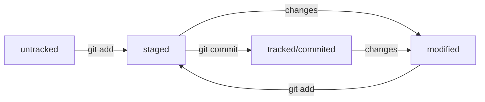

# Шпаргалка по GIT

## Командная строка

### Навигация

`pwd` - выводит текущую (рабочую) директорию  
`ls` - выводит содержание рабочей директории  
`ls -a` - также выводит и скрытые файлы (начинаются с `.`)  
`cd <адрес папки>` - перейти в папку  
`cd ..` - перейти в родительскую директорию  
`cd ~` - перейти в домашнюю директорию  
`cd /c` - перейти в корневую директорию **для Windows**  

### Работа с файлами и папками  
`touch <имя файла>` - создать файл в рабочей дериктории  
`touch <имя файла 1> <имя файла 2> <имя файла 3>` - можно создать сразу несколько файлов  
`mkdir <имя дериктории>` - создать новую директорию в рабочей

`cp <имя файла> <куда>` - копировавть файл  
`mv <имя файла> <куда>` - переместить файл  

`cat <имя файла>` - вывести содержание **текстового** файла

`echo "Текст"` - выводит в консоль то, что ей передали в качестве параметра
`>` - перезапишет вывод команды в файл
`>>` - допишет вывод команды в конец файла
`echo "Текст" >> file.txt` - добавит Текст в конец файла

**При удалении через команды файлы не попадают в корзину**  
`rm <имя файла>` - удалить файл  
`rmdir <имя дериктории>` - удалить **пустую** пустую  
`rm -r <имя дериктории>` - удалить дерикторию со всем содержанием, `r` значит рекурсивно

Можно выполнить несколько команд, разделив их `&&`  
Можно набрать первые символы имени и дважды нажать `Tab`, командная строка допишет назание или выведет все элементы на эти буквы  

## Работа с GIT

`git init` - сделать папку репозиторием  
`rm -rf .git` - *разгитить папку*, ключ `-f` избавляет от вопросов *Точно ли нужно удалять папку?*

`git status` - проверить состояние репозитория
`git status --ignored` - вывести вместе с игнорируемыми файлами

`git add <имя файла 1> <имя файла 2>` - проиндексировать файлы (подготовить файлы к сохранению (commit))  
`git add .` - индексирует все файлы в директории  
`git add --all` - тоже самое

`git commit -m '<описание коммита>'` - сделать коммит  
`git commit --amend --no-edit` - Дополнить/изменить коммит новыми файлами, не меняя сообщение  
`git commit --amend -m "Описание коммита"` - Дополнить/изменить коммит новыми файлами, изменив сообщение

`git log` - вывести все коммиты  
`git log --oneline` - вывести сокращённый лог

`git restore --staged <file>` - Выполнить unstage изменений  
`git restore <file>` - выполнить сброс файла из modified до tracked или staged  
`git reset --hard <commit hash>` - Откатитья до этого коммита

`git diff` - выводит отличия файлов modified от их закомиченных версий  
`git diff --staged` - выводит отличия файлов staged от их закомиченных версий  
`git diff <коммит1> <коммит2>` - выводит отличия между коммитами

## Связь с GitHub

`ls -la .ssh/` - вывести все SSH ключи  
`ssh-keygen -t ed25519 -C \"электронная почта, к которой привязан ваш аккаунт на GitHub\"` - генерация SSH пары  
`ssh-keygen -t rsa -b 4096 -C "электронная почта, к которой привязан ваш аккаунт на GitHub"` - генерация SSH пары другим алгоритмом  
Дальше будет запрос директории для сохранения (нажать `Enter` для сохранения в директори по умолчанию) и кодового слова (можно нажать `Enter`, чтобы пропустить)  
**Ключ с расширением `.pub` - публичный, им можно делиться, другим нельзя!**  
`ssh -T git@github.com` - соединение с GitHub и проверка ключа

`git remote add origin git@github.com:Larin-Igor/GIT_edu` - привязать удалённый репозиторий к локальному  
`git remote -v` - проверить, что они связались  
`git push` - отправить изменнеия на удалённый репозиторий

## Теория об устройстве Git

### Хэш

`Хеш` — основной идентификатор коммита и позволяет узнать его автора, дату и содержимое закоммиченных файлов.  
В папке `.git` есть служебный файл `HEAD`. Он указывает на самый свежий коммит.  
Вместо хеша последнего коммита можно написать слово `HEAD` — Git вас поймёт.

### Цикл жизни файла
У файлов в выводе `git status` есть несколько состояний:  
`untracked` - Git *видит*, что такой файл существует, но не следит за изменениями в нём  
`tracked` - Git следит за изменениями в файле  
`modified` - Git сравнил содержимое файла с последней сохранённой версией и нашёл отличия.  
`staged` - Файл в `staging area` (от англ. stage — «сцена», «этап процесса» и area — «область»), то есть в списке файлов, которые войдут в коммит.  
`Staging area` также называют `index` (англ. «каталог») или `cache` (англ. «кеш»), а состояние файла `staged` иногда называют `indexed` или `cached`.

### Файл `.gitignore`

Чтобы Git игнорировал файлы и не пытался добавить их в репозиторий, нужно включить их в этот файл

`#` - просто комментраий для пояснения  
`file.txt` - игнорировать файл с таким назанием везде  
`*.jpeg` - игнорировать все файлы с jpeg в конце имени  
`docs/*/tmp` - игнорировать все файлы tmp во всех подпапках  
`file?.txt` - Вопросительный знак ? соответствует одному любому символу  
`file[0-2].txt` - Скобочки обозначают диапазон симолов для игнорирования  
`/todo.txt` - слэш вначале значит проигнорировать только в корневой папке  
`build/` - игнорировать папку build  
`docs/**/tmp` - В отличии от `*`, символ `**` обозначает не 1, а любое кол-во папок  
`!doge.jpeg ` - `!` обозначает исключение из пракил (они будут включены в репозиторий)